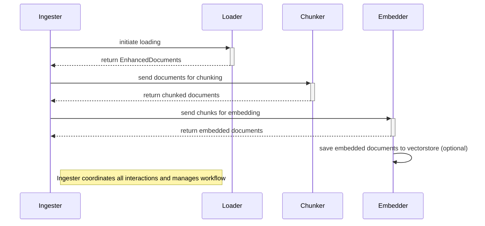

### Goal
The goal of this project was to design and implement a python package that lets
the user easily ingest a textual dataset into a vectorstore. 

### Priorities

1. Convenience:  Ingest a dataset in just a few lines of code!
2. Performance: Use multiprocessing where applicable to fully leverage your compute's capabilities. [^1]
3. Customizability: Easily override the default loading, chunking, and embedding functions.
4. Modularity: Use the loader, chunker, and embedder functionality separately if needed.
5. Extendability: Heavy documentation and tests.

Key design principles

1. Avoid re-inventing the wheel: Leveraged open source libraries (mainly LangChain[^2]).
2. DRY (Don't Repeat Yourself): Organized code in order to provide modularity and prevent duplication. 

### Design Overview

#### Class Structure
Here's the high level overview of the classes and how they interact with each other.

While the right level of abstraction when ingesting textual data into a vectorstore is somewhat subjective, three distinct steps stand out:

1. Standardizing the input dataset.
2. Chunking the standardized data.
3. Embedding the chunked data.

Additionally, we make the assumption that the usual access pattern here is that we would want to use the same loading, chunking, and embedding mechanism across multiple datasets within a given application, since this would provide consistency for downstream applications. With this assumption, it makes sense to have a `Loader`, `Chunker`, and `Embedder` class. Each instance of the class would share state information like how it should load, chunk, and embed data. We also have an `Ingester` class, which is responsible for transferring data through the instances of the three classes mentioned earlier.

Another layer of abstraction that proves useful is that of a `EnhancedDocument` [^3], which is essentially a piece of text accompanied by some additional information. The key information any `Document` must have is the following:

a. `source`: the path of the file. We assume the dataset is static (i.e. the raw data does not change).
b. `page_content`: the actual text of the file.
c. `metadata`: additional information about the document. Often useful for querying within the context of knowledge graphs.
d. `document_hash`,  `content_hash`, `metadata_hash`: hashes of the content, metadata, and overall document. Useful when checking uniqueness.

Since there is a one-to-many relationship between a `EnhancedDocument` and its chunks - the chunk retains the original document's source and metadata - the *type* of a chunk is the same as the type of an "unchunked" document. Hence, the package treats chunks data as `EnhancedDocuments` too.

Each class performs actions related to its position in the ingestion pipeline. The unit of information being transferred between classes is an `EnhancedDocument`. 

#### Misc Implementation Details

- For performance reasons, I've tried to use iterators and batching where possible, both to leverage vectorization and to be more space efficient. 
- For its first iteration, this package does not try to implement upserts/idempotence, nor does it clean indexes (this is the main purpose of LangChain's Indexing API, but I didn't get the time to implement this).
- I did not try to optimize the package size/dependencies used - I figured this would not be the limiting factor here.

### Possible Enhancements

Given that my goal was to spend less than a week working on this, many tradeoffs were made. I'll highlight the main ones here.

#### Testing

Due to time constraints, I focused on getting the package to a functional state first. This package contains a few unit tests for the `Loader` and `Chunker` classes, but they are by no means exhaustive. I plan on adding more unit tests in the future. For integration tests, a few scenarios I think would be worth testing are:

1. Running the ingestion pipeline on the same dataset twice using the same vectorstore [^4].
2. Create a sample dataset of a few sentences that have clear and distinct categories. Ingest this into a vectorstore and perform similarity search, verifying that it returns the expected results.

#### Customizability

Providing more defaults for the Document Loaders, Embedders, and Vectorstores.  Also, providing the ability to easily select a relevance score for the vectorstore would be nice.

#### Performance

This package doesn't leverage distributed computing/multiple GPUs efficiently right now. It might be worth sharding the dataset and parallelizing the work across available GPUs, or using something like Ray to do this ([example](https://gist.github.com/waleedkadous/4c41f3ee66040f57d34c6a40e42b5969#file-build_vector_store_fast-py-L30)).

### Footnotes

[^1]: More work can be done to allow this package to fully leverage multiple GPUs. See the *Future Work* section.

[^2]: However, I have come to realize that the convencience provided by LangChain's wrappers are sometimes *not* worth the limitations it enforces :) .

[^3]: The package doesn't use the name `Document` since LangChain has claimed that name. Also, LangChain has a `_HashedDocument` class that offers similar functionality, but since its a private class, it isn't used by this package.

[^4]: This currently fails due to limitations with Faiss' implementation. Fixing this either requires more custom logic for upserts, or switching to using LangChain's Indexing API. See Faiss' default configuration in `defaults.py` for more.